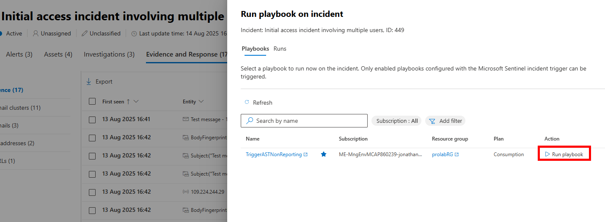
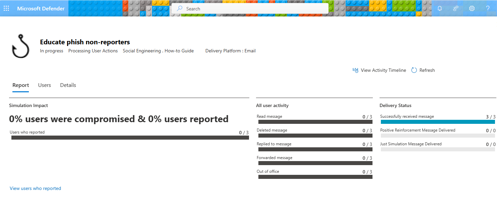
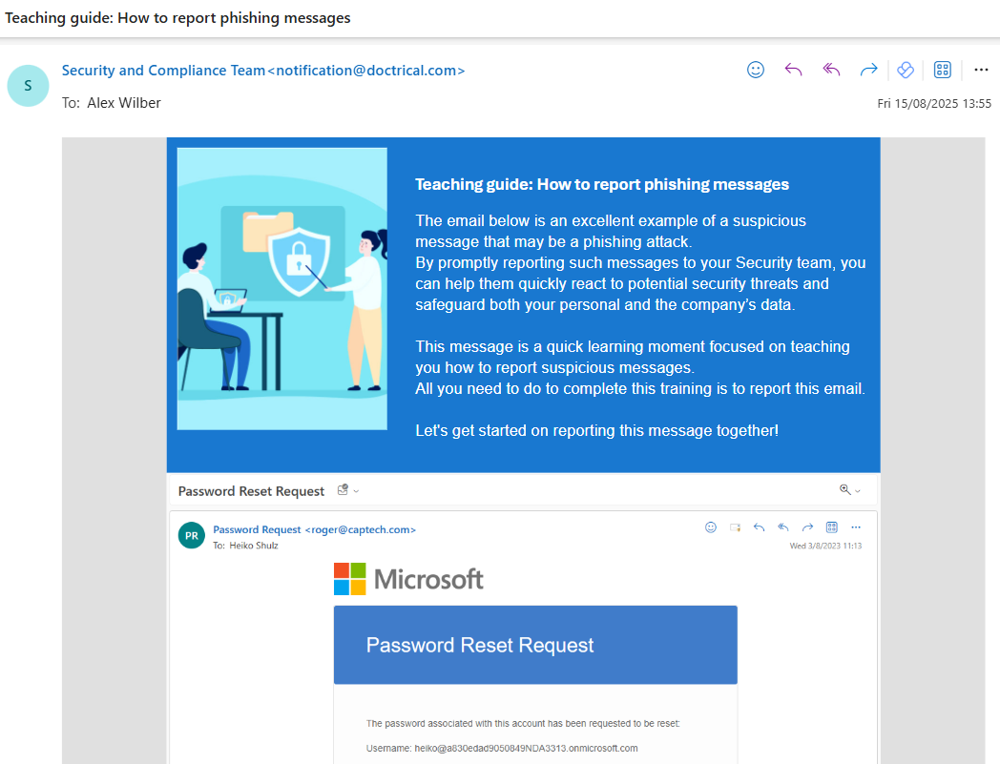

# Trigger Attack Simulation for non-reporting users

This playbook will execute using an incident based trigger and determine which mailboxes received malicious phishing emails, and calculate which users failed to perform a user submission (Report Message as Phish) to the SOC. It will trigger an Attack Simulator 'How-To Guide' simulation to educate these end-users on the correct response when receiving a Phish email in an inbox.

## Screenshots








## Installation

Deploy the Logic App into Azure:

[](https://portal.azure.com/#create/Microsoft.Template/uri/https%3A%2F%2Fraw.githubusercontent.com%2Fjonade%2FSentinelRunbooks%2Frefs%2Fheads%2Fmain%2FDefender%20for%20Office%20365%2FTrigger%20AST%20for%20NonReporting%20users%2Fazuredeploy.json)


### Post deployment

After using the ARM template to deploy the Logic App, the required Graph API permissions still need to be added to the Managed Service Principal that was created. 

This can be achieved by running the `addGraphPermission.ps1` script from this repository in PowerShell.


Ensure you have the required PowerShell modules to run this script by running:

```powershell
Install-Module -Name Microsoft.Graph.Authentication,Microsoft.Graph.Applications
```